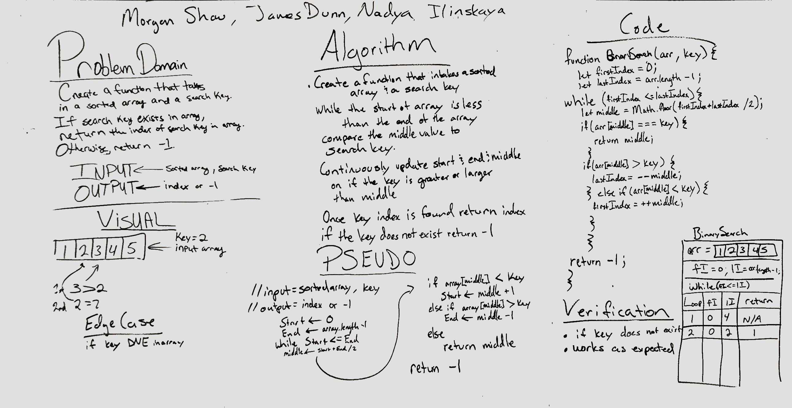

# Author:
Morgan Shaw
Nadya Ilinskaya
James Dunn

# Binary Search
A function called BinarySearch which takes in 2 parameters: a sorted array and the search key. It returns the index of the array’s element that is equal to the search key, or -1 if the element does not exist.

## Challenge
Write a function called BinarySearch which takes in 2 parameters: a sorted array and the search key. Without utilizing any of the built-in methods available to your language, return the index of the array’s element that is equal to the search key, or -1 if the element does not exist.

## Approach & Efficiency
While loop through the array: Find the middle of the array. Compare the value that is located at the index = middle to the search key. Because the array is sorted we can determine to change our search parameters to the left or the right of the array. Once the index is found return the index, if the key does not exist in the array return -1. 

## Solution
[link](./array-binary-search.js)
[Repl.it](https://repl.it/repls/OrneryCurlyDividend)
