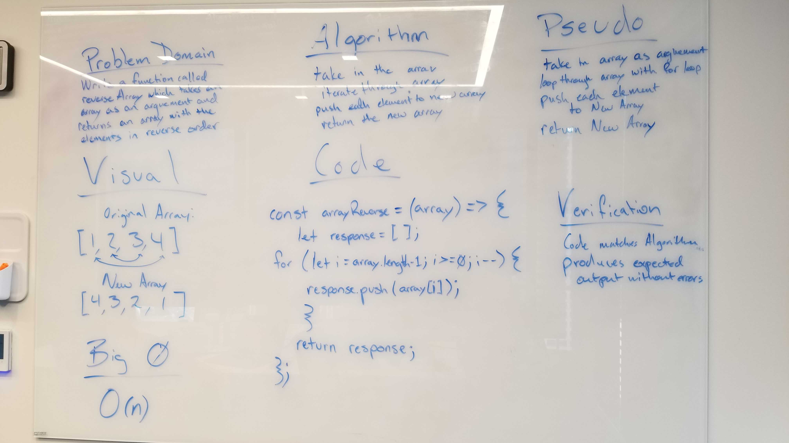

# Reverse an Array
revereseArray is a function that takes an array as an argument. It will return the reverse order of the array without using any built in javascript methods. 

## Challenge
Write a function called reverseArray which takes an array as an argument. Without utilizing any of the built-in methods available to your language, return an array with elements in reversed order.

## Approach & Efficiency
I used a basic for loop to iterate throught the array in reverse. I then pushed each element to a new array. Then I returned the new array to complete the function. 

## Solution
[link](./array-reverse.js)
[Repl.it](https://repl.it/repls/HorribleWiltedCharactercode)
